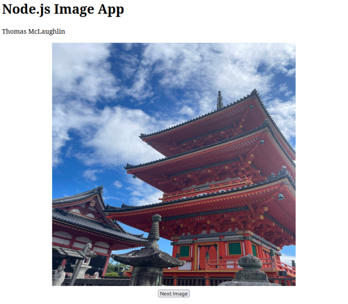
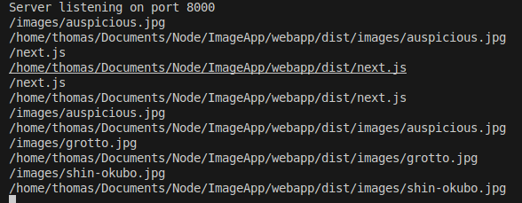

# NodeJS-ImageApp

## Overview
This application allows users to flip through images provided by server.


## Instruction
Navigate to: ```/home/thomas/Documents/Node/ImageApp/webapp``` and ```run npm``` start to start the server.
Once running, navigate to the browser and go to ```localhost:8000``` to view the application

## Notable Observations
- All assets are requested
  - Images, additional JavaScript, html, etc.
    - all files...
- The browser will cache assets
  - Files such as the next.js were cached by the browser and not requested everytime
    
